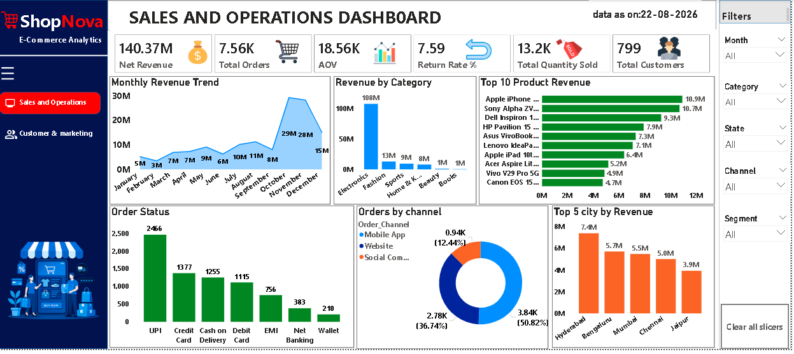
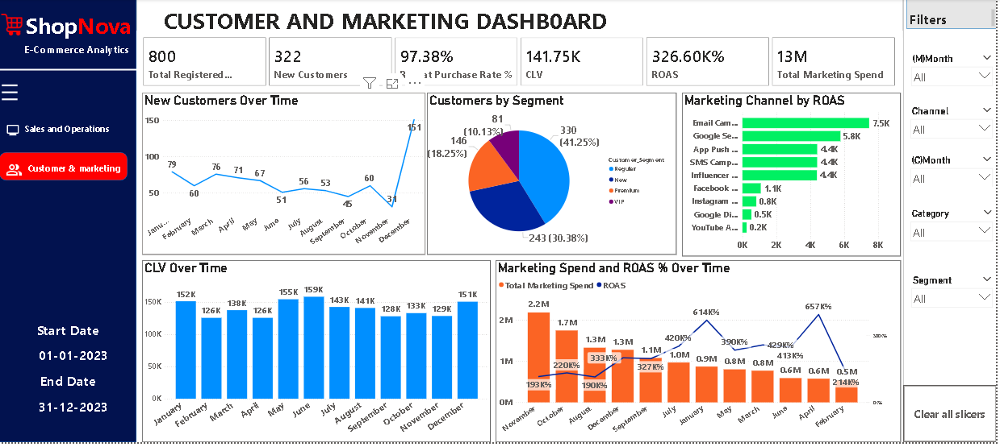
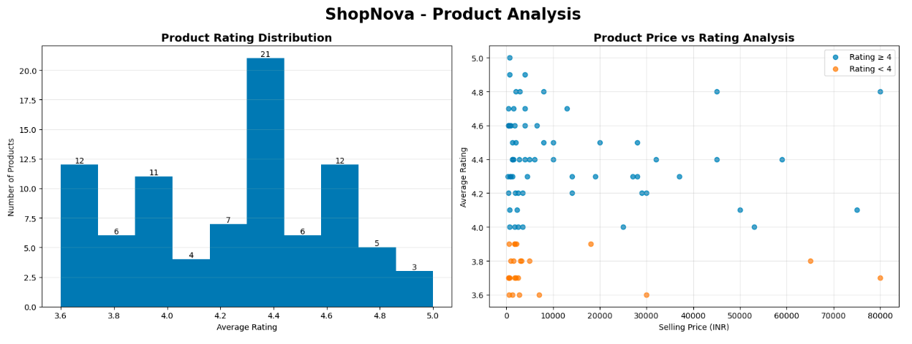
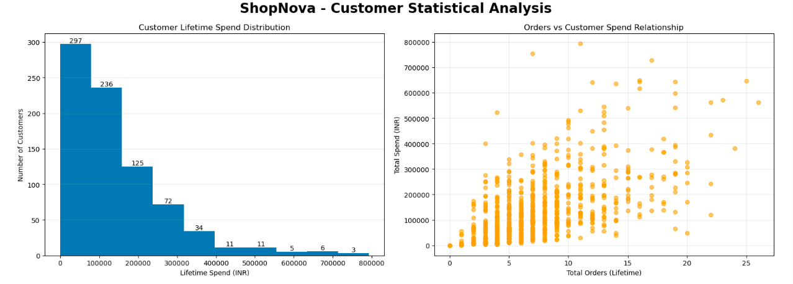
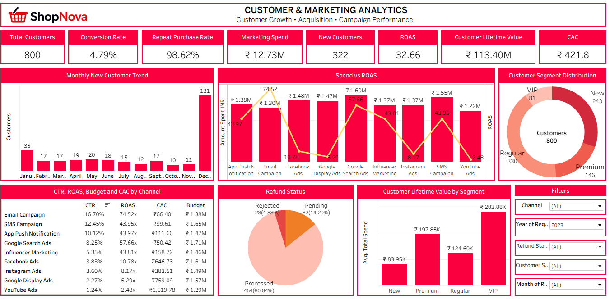

# ShopNova E-Commerce Data Analytics Project

---

## 📌 Project Overview

ShopNova is an end-to-end E-Commerce Data Analytics project designed to analyze sales, customers, products, marketing performance, and business operations.

The project uses **SQL, Excel, Python, Power BI, and Tableau** to transform business data into meaningful insights and interactive dashboards.

---

## 🎯 Business Objectives

- Analyze overall sales and revenue performance
- Understand customer behavior
- Analyze new and repeat customers
- Identify customer segments
- Analyze product ratings and pricing
- Measure marketing campaign performance
- Analyze marketing spend and ROAS
- Calculate Customer Lifetime Value (CLV)
- Analyze orders and sales channels
- Identify top-performing categories and products
- Analyze sales and operational performance

---

## 🛠️ Tools & Technologies

- SQL / MySQL
- Microsoft Excel
- Python
- Pandas
- NumPy
- Matplotlib
- Power BI
- DAX
- Tableau

---

# 📊 Dashboards & Analysis

## 1. Power BI – Sales & Operations Dashboard

The dashboard analyzes:

- Net Revenue
- Total Orders
- Average Order Value (AOV)
- Return Rate
- Total Quantity Sold
- Total Customers
- Monthly Revenue Trend
- Revenue by Category
- Top 10 Product Revenue
- Order Status
- Orders by Channel
- Top Cities by Revenue

### Dashboard Preview



---

## 2. Power BI – Customer & Marketing Dashboard

The dashboard analyzes:

- Total Customers
- Conversion Rate
- Repeat Purchase Rate
- Marketing Spend
- New Customers
- ROAS
- Customer Lifetime Value
- Customer Acquisition Cost
- Monthly New Customer Trend
- Marketing Spend vs ROAS
- Customer Segment Distribution
- Refund Status
- CLV by Customer Segment
- Marketing Channel Performance

### Dashboard Preview



---

## 3. Python – Exploratory & Statistical Analysis

Python was used for exploratory data analysis, statistical analysis, and visualization.

### Product Analysis

- Product Rating Distribution
- Product Price vs Rating Analysis

### Analysis Preview



---

### Customer Statistical Analysis

- Customer Lifetime Spend Distribution
- Orders vs Customer Spend Relationship

### Analysis Preview



---

## 4. SQL Analysis

SQL / MySQL was used to:

- Calculate business KPIs
- Aggregate sales data
- Analyze customers
- Analyze orders
- Calculate revenue metrics
- Perform grouping and filtering
- Extract business insights

---

## 5. Tableau Dashboard

Tableau was used to create interactive business visualizations and support data-driven analysis.

### Dashboard Preview



---

# 📈 Key Business KPIs

- Total Customers
- Total Orders
- Net Revenue
- Average Order Value
- Return Rate
- Quantity Sold
- New Customers
- Conversion Rate
- Repeat Purchase Rate
- Marketing Spend
- ROAS
- Customer Lifetime Value
- Customer Acquisition Cost

---

# 🔍 Key Insights

The analysis helps identify:

- Monthly sales and revenue trends
- High-performing product categories
- Top revenue-generating products
- Customer segment performance
- Marketing channels with better ROAS
- Customer spending behavior
- Relationship between orders and customer spending
- Product rating patterns
- Operational and order-status trends

---

# 🔄 Project Workflow

**Raw Data → Data Cleaning → SQL Analysis → Python EDA → Power BI / Tableau → Business Insights**

---

# 📁 Project Files

```text
ShopNova/
│
├── README.md
├── ShopNova_Dashboard.pbix
├── ShopNova_Dashboard.twbx
├── ShopNova_Data.xlsx
├── Shopnova_Analysis.sql
├── Python_Shopnove_Analysis.html
├── project_summary.pptx
│
├── Powerbi_customer_marketing.png
├── powerbi_sales_operations.png
├── python_product_analysis.png
├── python_customer_analysis.png
├── Sales statistical Analysis Python.png
└── tableau_dashboard.png
```

---

# 💡 Skills Demonstrated

- Data Cleaning
- Data Transformation
- Exploratory Data Analysis
- SQL Querying
- KPI Development
- Statistical Analysis
- Data Visualization
- Dashboard Development
- DAX
- Business Analysis
- Customer Analytics
- Marketing Analytics
- Sales Analytics

---

# 👨‍💻 Project Type

**E-Commerce Data Analytics**

# 📌 Author

**Your Name**
